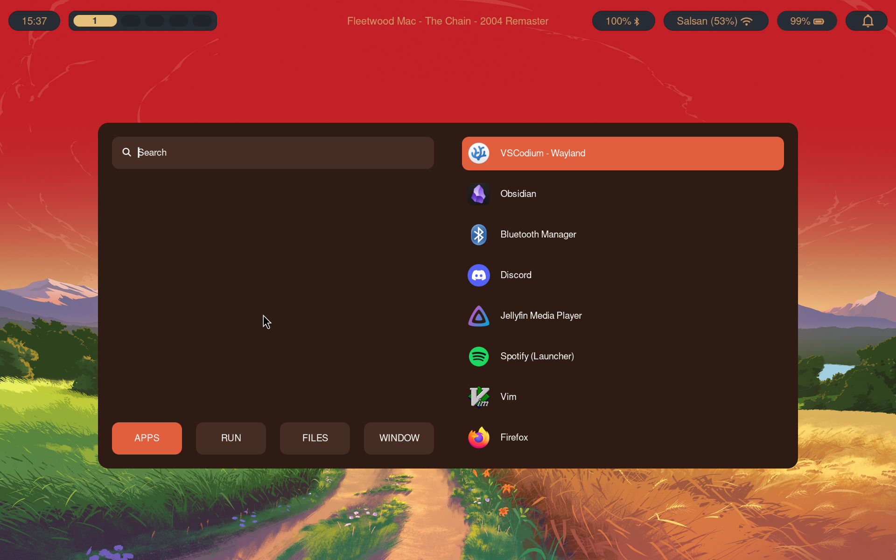

#  Astr0Noah's Arch - Hyprland Dotfiles

My personal desktop environment configuration for Arch Linux using Hyprland. 

| Component | Tool |
| :--- | :--- |
| **WM** | Hyprland |
| **Terminal** | Kitty |
| **Widgets** | Quickshell |
| **App Launcher** | Rofi |
| **Wallpapers** | swww |
| **Bar** | Waybar |
| **Theming** | nwg-look & xsettingsd |

## Screenshots





---

## Dependencies

You can install most of these via `pacman` or an AUR helper like `yay`.

| Category | Package Name | Description |
| :--- | :--- | :--- |
| **Compositor** | `hyprland` | wayland compositor |
| **Terminal** | `kitty` | terminal emulator |
| **Bars & UI** | `waybar`, `quickshell` | top bar and custom shell widgets |
| **Launcher** | `rofi-wayland` | application launcher and menus |
| **Wallpaper** | `swww` |  animated wallpaper daemon |
| **Screenshots** | `grim`, `slurp` | grabs the screen and selects regions |
| **Media Controls** | `playerctl` | controls Spotify and other media players |
| **Theming** | `nwg-look`, `xsettingsd` | GTK theme management for Wayland/XWayland |

*(Requires a Nerd Font, e.g., `ttf-jetbrains-mono-nerd`, for waybar icons).*

---

##  Installation

**Note:** Always back up your existing files before installing.

**1. Clone this repository**
```bash
git clone [https://github.com/Astr0Noah/dotfiles-Hyprland-1.git](https://github.com/Astr0Noah/dotfiles-Hyprland-1.git)
cd dotfiles-Hyprland-1
```
## THANKS FOR READING :)
